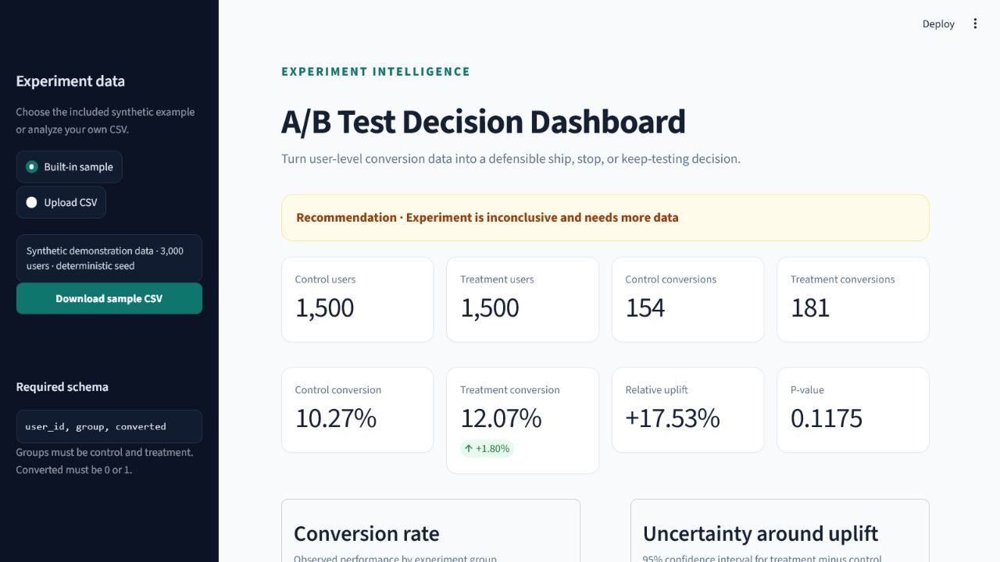

# A/B Test Decision Dashboard

> **Turn raw experiment data into a clear ship / hold / keep-testing decision — in seconds.**

Product teams run A/B tests to make better decisions. But turning a CSV of user data into a confident answer is slow, error-prone, and requires statistical expertise most teams don't have on hand. This dashboard eliminates that bottleneck.

Upload your experiment data (or use the built-in demo), and the dashboard instantly tells you:

- **Should you ship the new version?** — a plain-English recommendation
- **How big is the real-world impact?** — projected extra conversions per month and per year
- **How confident are you?** — statistical significance at a glance
- **How many users do you still need?** — sample-size planning for the next test

No statistics degree required.

---

## Live Demo

> 🚀 **[Try it on Streamlit Community Cloud →](https://ab-test-decision-dashboard.streamlit.app)**

---

## Screenshots



---

## Who is this for?

| Role | What they get |
|---|---|
| **Product Manager** | A clear ship/hold recommendation + projected monthly uplift in real numbers |
| **Designer** | Instant feedback on whether a UI change moved the needle |
| **Marketer** | Conversion lift translated into annualised business impact |
| **Data Analyst** | Full statistical detail — z-test, p-value, CI — in one downloadable CSV |
| **Engineer** | Clean Python codebase, modular architecture, full test suite |

---

## Features

- **Business Impact Panel** — projects extra conversions per month and year based on your monthly active user count
- **Plain-English decision** — leads with the answer, not the formula
- CSV upload with clear, aggregated validation feedback
- Built-in synthetic dataset for immediate exploration (no upload needed)
- Control and treatment sample sizes, conversions, and conversion rates
- Absolute and relative uplift
- Two-sided two-proportion z-test with p-value
- 95% confidence interval for the treatment-minus-control rate difference
- Interactive Plotly conversion-rate and confidence-interval charts
- Downloadable one-row results summary (CSV)
- Sample-size calculator for planning future experiments
- Automated unit and Streamlit smoke tests

---

## Quick start (local)

Python 3.11 or newer is recommended.

### Windows PowerShell

```powershell
cd path\to\ab-test-decision-dashboard
python -m venv .venv
.\.venv\Scripts\Activate.ps1
python -m pip install --upgrade pip
python -m pip install -r requirements.txt
python -m streamlit run app.py
```

### macOS or Linux

```bash
cd path/to/ab-test-decision-dashboard
python3 -m venv .venv
source .venv/bin/activate
python -m pip install --upgrade pip
python -m pip install -r requirements.txt
python -m streamlit run app.py
```

Streamlit prints the local URL, normally `http://localhost:8501`.

---

## How to use the dashboard

1. **Start with the built-in sample** to explore a complete analysis immediately.
2. **Set your monthly active users** in the sidebar — this powers the Business Impact Panel.
3. Switch to **Upload CSV** to analyze your own experiment data.
4. Fix any validation issues shown by the app.
5. Read the recommendation, review the charts, and download the results CSV.
6. Use the **sample-size calculator** at the bottom to plan the next test.

---

## Expected CSV format

The app accepts a CSV with these three required columns:

| Column | Meaning | Accepted values |
|---|---|---|
| `user_id` | Unique participant identifier | Any non-empty unique value |
| `group` | Experiment variant | `control` or `treatment` |
| `converted` | Did the user convert? | `0` (no) or `1` (yes) |

Extra columns are allowed and ignored. An example file is at `data/upload_example.csv`.

---

## Statistical methodology

Let $p_t$ and $p_c$ be the observed treatment and control conversion rates.

- **Absolute uplift:** $p_t - p_c$
- **Relative uplift:** $(p_t - p_c) / p_c$, when the control rate is non-zero
- **Hypothesis test:** two-sided pooled two-proportion z-test
- **Null hypothesis:** $p_t = p_c$
- **Confidence interval:** unpooled Wald interval for $p_t - p_c$
- **Default significance level:** $\alpha = 0.05$

The dashboard recommends a winner only when the two-sided p-value is below the significance level.

The sample-size calculator uses Cohen's $h$ and the normal approximation for an equal-allocation, two-sided independent-proportions test.

### Practical assumptions

The analysis assumes independent observations, one row per user, stable assignment, and a pre-specified primary conversion metric. Statistical significance does not replace checks for instrumentation quality, sample-ratio mismatch, guardrail metrics, novelty effects, or business value.

---

## Project structure

```text
ab-test-decision-dashboard/
├── .streamlit/config.toml
├── ab_test_dashboard/
│   ├── charts.py        # Plotly visualizations
│   ├── reporting.py     # Plain-English explanations & CSV export
│   ├── sample_data.py   # Deterministic synthetic dataset
│   ├── statistics.py    # Z-test, CI, sample-size calculator
│   └── validation.py    # CSV validation & normalization
├── data/upload_example.csv
├── docs/screenshots/dashboard.png
├── tests/
│   ├── test_app.py
│   ├── test_reporting.py
│   ├── test_statistics.py
│   └── test_validation.py
├── app.py               # Streamlit entry point
├── requirements.txt
└── README.md
```

---

## Run tests

```bash
python -m pytest -q
```

The suite covers validation failures, numerical calculations, decision branches, sample-size estimation, export content, and a full app-render smoke test.

---

## Deploy to Streamlit Community Cloud

1. Push this repository to GitHub.
2. Sign in to [Streamlit Community Cloud](https://share.streamlit.io/).
3. Click **Create app**, select the repository and branch, set the main file to `app.py`.
4. Click **Deploy** — no secrets, API keys, or database setup required.

---

## License

This project is suitable for portfolio and educational use. Add the license that best matches your intended distribution before publishing.
